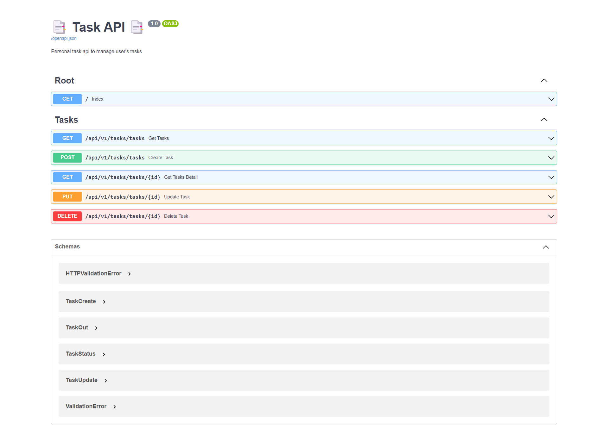
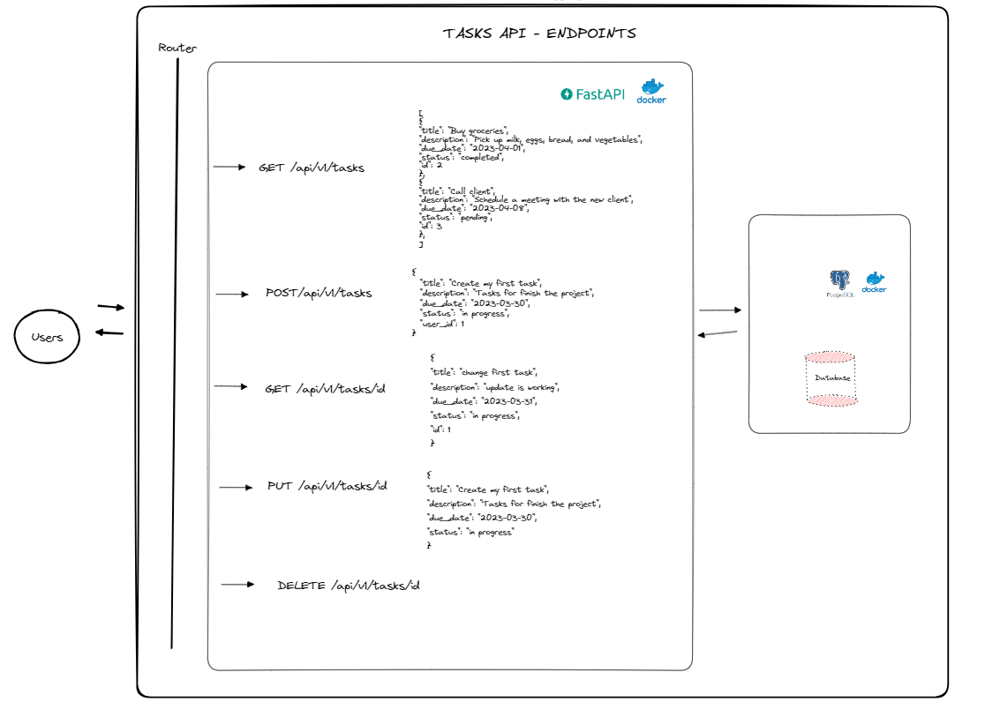
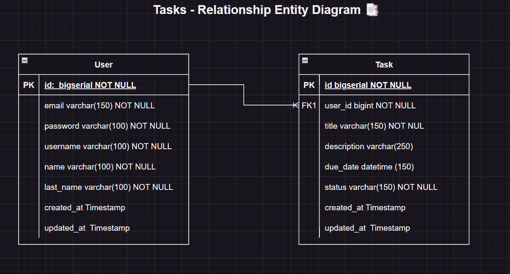

<h1 align="center" id="title">📑 Tasks API  📑</h1>

📈 Task API allows you to keep a complete record of your tasks and pending tasks all from one place.

## Table of Contents
- [Table of Contents](#table-of-contents)
- [🚀 Demo](#-demo)
- [System Design](#system-design)
- [Entity-Relationship Diagram](#entity-relationship-diagram)
- [💡Features](#features)
- [🧑‍💻 Installation Steps](#-installation-steps)
- [The process](#the-process)
  - [🏗️ Build with](#️-build-with)
- [Licence](#licence)
- [Author](#author)

## 🚀 Demo

## System Design

## Entity-Relationship Diagram

In order to see the application I created my own relationship model, identifying a one-to-many relationship between users and tasks.

## 💡Features
Here're some of the projects's best features:
- Creation of the project using FastAPI ✅
- Setup a Databse PostgreSQL ✅
- Define Data models for tasks✅
- Define schemas for validate data using pydantic ✅
- Create my own sql script to create the tables
- Implement crud endpoints for Tasks ✅

---
- Crear comprehensive documentation using Swagger ✅
- Use Docker to containerize the application for easy deployment and scalability.✅

## 🧑‍💻 Installation Steps
1. Clone the repository `git clone https://github.com/javieramayapat/api-tasks.git`
2. Create your virtual enviromen with the command `py -m venv venv`
3. Install requirements in your virtual enviroment `pip install -r requirements.txt`
4. Create the env file in the root of the project `.env` and copy the content of the `.env.example` to configurate environment variables.

5. You can run the following command to buil the image. `$ docker-compose build`

6. Once the image is built, run the container: `$ docker-compose up -d`

7. If you want to be faster in launching the project you can use the following command to perform the above two steps in one. `$ docker-compose up --build`
8. Now go to http://127.0.0.1:8000/docs and enjoy the app 😊.
##  The process
### 🏗️ Build with
Technologies used in this project:

- [Docker](https://www.docker.com/) 🐋
- [Python](https://www.python.org/) 🐍
- [FastAPI](https://fastapi.tiangolo.com/) 🚀
- [Pydantic ](https://pydantic-docs.helpmanual.io/) 💯
- [PostgreSQL](https://www.postgresql.org/) 🐘
- [SQLAlchemy](https://www.sqlalchemy.org/) ⚙️

To get started you just need to download docker on your machine, I leave the link right here. ➡️ [Docker](https://www.docker.com/get-started "Docker").

## Licence
> This project is licensed under the MIT License

## Author
Made with 💙 by [javieramayapat](https://www.linkedin.com/in/javieramayapat/)